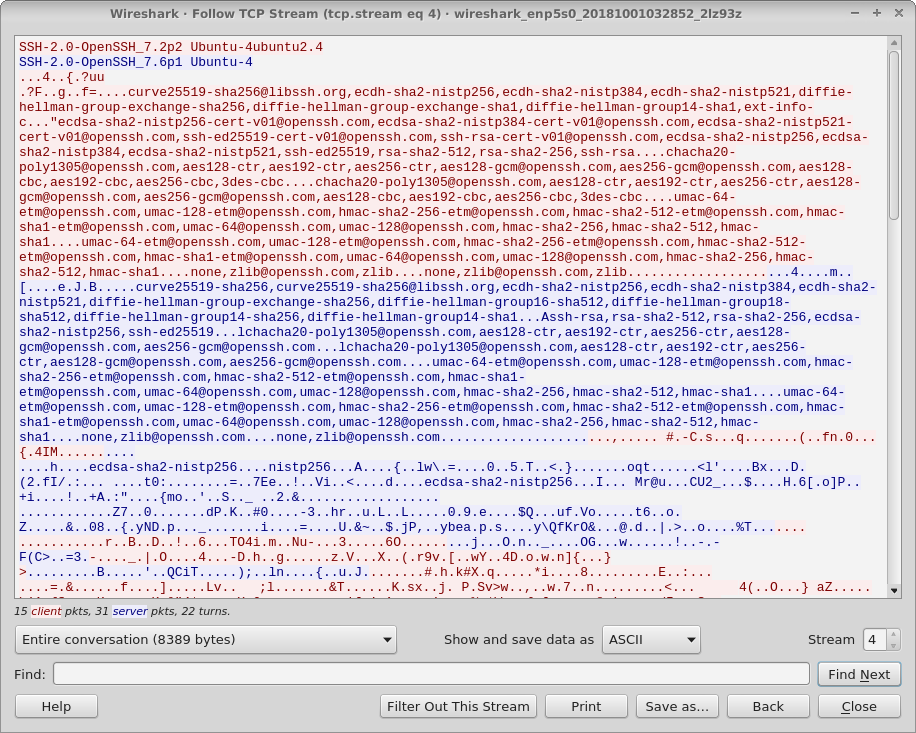

# SSH - Secure Shell

**SSH протокол**

- Сервис за рад на удаљеном рачунару
- Безбедна варијанта Телнет протокола
- Конзолни интерфејс, пренос података (SFTP)...
- Клијент-сервер архитектура
- Заштита се обезбеђује шифровањем података

**Инсталација на Убунту сервер ОС и покретање сервиса**

```
sudo apt update
sudo apt install openssh-server
...
sudo /etc/init.d/ssh status
sudo /etc/init.d/ssh start
```

### Прва конекција са сервером

**Проверавање отиска за ECDSA јавни кључ сервера (на серверу)**

```
$ ssh-keygen -l -f /etc/ssh/ssh_host_ecdsa_key.pub
256 SHA256:cdK2HZO2NUTWFAypnPoxhuONmcPO1c+KvWW2z5ZGAas root@server (ECDSA)
```

**Прва конекција (са клијента)**

```
$ ssh mmilanovic@192.168.0.20
The authenticity of host '192.168.0.20 (192.168.0.20)' can't be established.
ECDSA key fingerprint is SHA256:cdK2HZO2NUTWFAypnPoxhuONmcPO1c+KvWW2z5ZGAas.
Are you sure you want to continue connecting (yes/no)? yes
Warning: Permanently added '192.168.0.20' (ECDSA) to the list of known hosts.
mmilanovic@192.168.0.20's password:
Welcome to Ubuntu 18.04.1 LTS (GNU/Linux 4.15.0-34-generic x86_64)
```

**Листање активних корисника (невезано за SSH)**

```
$ w
 00:46:46 up 21 min,  2 users,  load average: 0.00, 0.00, 0.00
USER     TTY      FROM             LOGIN@   IDLE   JCPU   PCPU WHAT
mmilanov tty1     -                00:30    1:14   0.33s  0.30s -bash
mmilanov pts/0    192.168.0.17     00:44    0.00s  0.05s  0.01s w

$ who am i
mmilanovic pts/0        Oct  1 00:44 (192.168.0.17)
```

**Нови сервер је додат у `~/.ssh/known_hosts` фајл (на клијенту)**

```
$ cat .ssh/known_hosts 
|1|HA8DQ/zp9goX/bJNelSsg7bGQxI=|rW3HB+fQZZ97qO42YZCWukw7BpI= ecdsa-sha2-nistp256 AAAAE2VjZHNhLXNoYTItbmlzdHAyNTYAAAAIbmlzdHAyNTYAAABBBBDnj3sewWx3XOY9wcnsAzAb3jXMVIXaPK19guv9mcyvzW9xdAcXgfSb9TxsJxr5rh5CeI/2wUTgKDKfZkkvhjo=
```

### Аутентификација путем кључа

**Генерисање пара кључева (на клијенту)**

```
$ ssh-keygen -t rsa
Generating public/private rsa key pair.
Enter file in which to save the key (/home/mmilanovic/.ssh/id_rsa): 
Enter passphrase (empty for no passphrase):
Enter same passphrase again:
Your identification has been saved in /home/mmilanovic/.ssh/id_rsa.
Your public key has been saved in /home/mmilanovic/.ssh/id_rsa.pub.
The key fingerprint is:
SHA256:PMIBcsn8Y4/m2cre1nVgU2lWRFEs2jS+zgpETLDSeRk mmilanovic@dev
The key's randomart image is:
+---[RSA 2048]----+
|  .oo.  ..E    BB|
|   o+. . = o  O .|
|     .o + =  O o |
|     .++ o  = o  |
|     .o+S .. o . |
|      o..o  . o  |
|     o o ... +   |
|     .o.o ..  o  |
|     .+o.   ..   |
+----[SHA256]-----+

$ ls -ahl .ssh/
total 20K
drwx------  2 mmilanovic mmilanovic 4,0K Oct  1 02:58 .
drwxr-xr-x 30 mmilanovic mmilanovic 4,0K Oct  1 02:54 ..
-rw-------  1 mmilanovic mmilanovic 1,8K Oct  1 02:56 id_rsa
-rw-r--r--  1 mmilanovic mmilanovic  396 Oct  1 02:56 id_rsa.pub
-rw-r--r--  1 mmilanovic mmilanovic  222 Oct  1 02:58 known_hosts
```

**Слање јавног кључа серверу (са клијента)**

```
$ ssh-copy-id mmilanovic@192.168.0.20
/usr/bin/ssh-copy-id: INFO: Source of key(s) to be installed: "/home/mmilanovic/.ssh/id_rsa.pub"
/usr/bin/ssh-copy-id: INFO: attempting to log in with the new key(s), to filter out any that are already installed
/usr/bin/ssh-copy-id: INFO: 1 key(s) remain to be installed -- if you are prompted now it is to install the new keys
mmilanovic@192.168.0.20's password:

Number of key(s) added: 1

Now try logging into the machine, with:   "ssh 'mmilanovic@192.168.0.20'"
and check to make sure that only the key(s) you wanted were added.
```

**Сада можемо да се аутентификујемо серверу без коришћења лозинке (асиметрична криптографија)**

```
$ ssh mmilanovic@192.168.0.20
Enter passphrase for key '/home/mmilanovic/.ssh/id_rsa':
```

### Додатна конфигурација сервера

**Пожељно је урадити бекап оригиналног фајла пре измена**

```
cd /etc/ssh/
sudo cp sshd_config sshd_config.bak
sudo vim sshd_config
```

**Често коришћене директиве**

- `Port`

Подразумевани порт на којем ће сервер примати конекције. Подразумевана вредност је `22`, а пожељно је изменити тако да сервер слуша на неком други (нестандардни) порту (нпр. `2222`, `1234` и сл.).

- `HostKey`

Ове директиве дефинише локације где се налазе кључеви сервера, што нам је корисно при рачунању отиска које смо радили на почетку.

- `LoginGraceTime`

Ова директива дефинише после колико времена ће сервер прекинути конекцију са клијентом, уколико клијент и даље није аутентификован. Подразумевана вредност је `120`/`2m`, а пожељно је изменити тако да има тек мало већу вредност од броја секунди који је вама довољан да се улогујете на сервер (нпр. `30`).

- `PermitRootLogin`

Ова директива дефинише да ли сервер дозвољава да се корисник логује као рут. Подразумевана вредност је `yes`, а пожељно је изменити на `no`.

- `StrictMode`

Ова директива дефинише да ли сервер забрањује конекцију у случају да су аутентификациони фајлови незаштићени. Подразумевана вредност је `yes`.

- `PasswordAuthentication`

Ова директива дефинише да ли сервер дозвољава аутентификацију лозинком. Сада кад смо доставили наш јавни кључ на сервер, можемо променити вредност са подразумеване `yes` на `no`.

**Дозвола приступа новом порту и рестартовање сервиса**

```
sudo ufw allow 2222/tcp
sudo ufw show added
...
sudo /etc/init.d/ssh restart
```

**Успостављање конекције преко новог порта**

`ssh mmilanovic@192.168.0.20 -p 2222`

### Снимак SSH мрежног саобраћаја



## SFTP - SSH File Transfer Protocol

**FTP**

- Сервис за пренос фајлова
- Проблеми:
	- Корисничко име и лозинка путују у отвореном облику
	- Наредбе путују у отвореном облику
	- Листе са садржајем директоријума путују у отвореном облику
	- Садржај фајлова се преноси у отвореном облику
- Решење:
	- Шифровање саобраћаја

**Безбедни FTP**

- Коришћењем SSL/TLS протокола (FTPS)
- Коришћењем SSH протокола (SFTP)

**Успостављање SFTP конекције и преузимање удаљеног фајла**

```
$ sftp -P 2222 mmilanovic@192.168.0.20
Enter passphrase for key '/home/mmilanovic/.ssh/id_rsa':
Connected to 192.168.0.20.
sftp> ls -a
.                             ..                            .bash_history
.bash_logout                  .bashrc                       .cache
.gnupg                        .profile                      .ssh
.sudo_as_admin_successful     .viminfo                      f.txt
sftp> get f.txt
Fetching /home/mmilanovic/f.txt to f.txt
/home/mmilanovic/f.txt                                  100%   50     0.1KB/s   00:00
sftp> exit
```

**Слање фајла на сервер преко SFTP конекције**

```
...
sftp> put /home/mmilanovic/.vimrc .vimrc
...
```

## Рад са програмима са графичким интерфејсом

**Укључујемо X11 прослеђивање приликом конекције и покрећемо неки графички програм (у овом случају *gedit* едитор)**

```
$ ssh -X mmilanovic@192.168.0.20 -p 2222
Enter passphrase for key '/home/mmilanovic/.ssh/id_rsa':
...
gedit
```

**Напомена:** Ово ће радити само у случају да је у конфигурационом фајлу директиви `X11Forwarding` задата вредност `yes`. У случају да је вредност директиве `no`, долази до грешке:

```
gedit
Unable to init server: Could not connect: Connection refused

(gedit:3306): Gtk-WARNING **: 02:49:11.085: cannot open display:
```

## SOCKS прокси

SSH сервер можемо користити и као прокси:

```
$ ssh -D 8123 mmilanovic@192.168.0.20 -p 2222
```

Употреба проксија:

- SOCKS host: localhost
- SOCKS port: 8123
- SOCKS v5

## Корисни програми

- sshpass
- [PuTTY](https://www.putty.org/)
- [ConnectBot](https://github.com/connectbot/connectbot)
- [FileZilla](https://filezilla-project.org/) (за SFTP)
