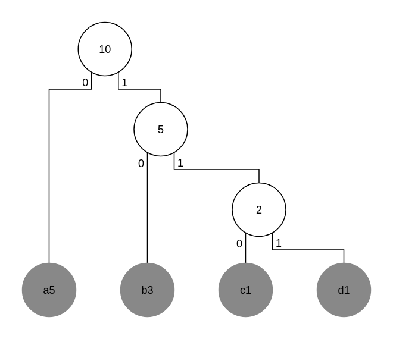

# Хафманов алгоритам кодовања

- енгл. *Huffman coding*
- Дејвид Хафман (енгл. *David Huffman*), МИТ
- *A Method for the Construction of Minimum-Redundancy Codes*, 1952. година
- Компресија без губитака (енгл. *lossless compression*)
- Базира се на редуданси по којој се неки карактери јављају чешће него остали
- Примена:
	- Програми за компресију података: gzip, bzip2
	- Формати за слике: JPEG, PNG

**Порука**

- `a-a-a-a-a-b-b-b-c-d`
- Дужина поруке: 10 карактера

**Симболи и вероватноће**

<table>
	<thead>
		<tr>
			<th>Симболи</th>
			<th>Број понављања</th>
			<th>Вероватноћа</th>
		</tr>
	</thead>
	<tbody>
		<tr>
			<td>a</td>
			<td>5</td>
			<td>0.5</td>
		</tr>
		<tr>
			<td>b</td>
			<td>3</td>
			<td>0.3</td>
		</tr>
		<tr>
			<td>c</td>
			<td>1</td>
			<td>0.1</td>
		</tr>
		<tr>
			<td>d</td>
			<td>1</td>
			<td>0.1</td>
		</tr>
	</tbody>
</table>

**Хафманово стабло**

**Хафманов речник**

<table>
	<thead>
		<tr>
			<th>Симбол</th>
			<th>Кодна реч</th>
		</tr>
	</thead>
	<tbody>
		<tr>
			<td>a</td>
			<td>0</td>
		</tr>
		<tr>
			<td>b</td>
			<td>10</td>
		</tr>
		<tr>
			<td>c</td>
			<td>110</td>
		</tr>
		<tr>
			<td>d</td>
			<td>111</td>
		</tr>
	</tbody>
</table>

**Кодована порука**

- `0-0-0-0-0-10-10-10-110-111`

**Запажања**

- Симбол са најчешћом фреквенцијом има најкраћу кодну реч
	- У овом случају: `a = 0`
- Симбол са најређом фреквенцијом има најдужу кодну реч
	- У овом случају: `c = 110` и `d = 111`

**Напомена:** већина материјала преузета са курса "Основи теорије информација и кодовања" на [Универзитету Сингидунум](https://singidunum.ac.rs).
