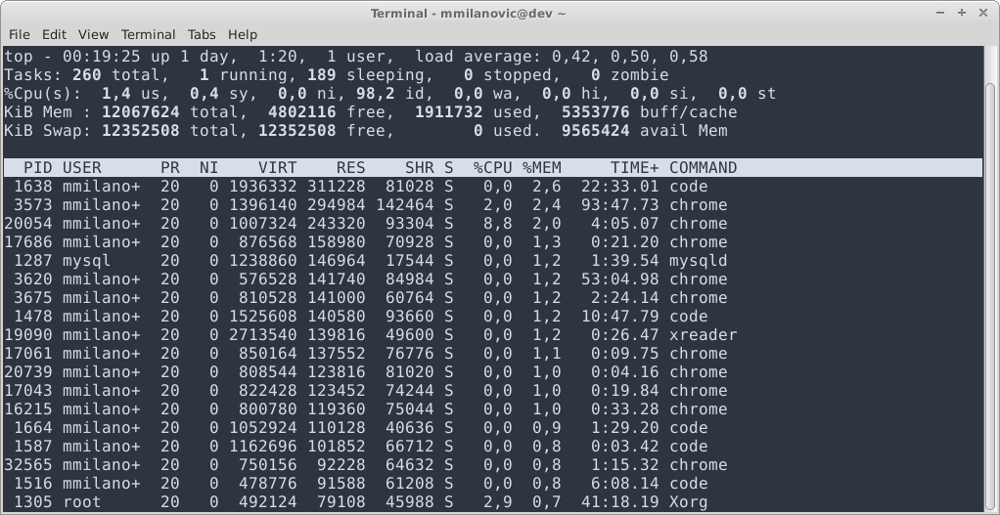

## Управљање процесима

**Појам програма, процеса, нити и задатка**

- Програм
	- енгл. *program*
	- Скуп инструкција
	- Може бити и на спољној меморији (не извршава се)
- Задатак
	- енгл. *task*
	- Програм учитан у радну меморију
- Процес
	- енгл. *process*
	- Задатак чије је извршавање у току
	- Програмске инструкције + тренутно стање меморије
	- Засебан меморијски простор, ресурси
- Нит
	- енгл. *thread*
	- Линија (редослед) извршавања инструкција (корака) процеса
	- Нити деле исти меморијски простор

**Гранање процеса**

- Процес може покренути:
	- језгро ОС
	- корисник
	- други процес
- Дете процес
	- енгл. *child process*
	- Процес кога је покренуо неки други процес
- Родитељски процес
	- енгл. *parent process*
	- Процес који је покренуо неки други процес
- Зомби процес
	- енгл. *zombie process*
	- Термин са UNIX/Linux ОС
	- Користи се и термин *defunct* процес
	- Процес који је завршен али још увек постоји на листи
	- Алоцирани ресурси се не ослобађају
- Процес сироче
	- енгл. *orphan process*
	- Процес чији је родитељски процес завршен
	- Извршавање и крај процеса се предвиђају нормално

**Завршетак процеса**

- Процес се уклања из меморије након завршетка
- Неки процеси се не заврше регуларно
	- процеси зомбији
	- везивање у мртав чвор
	- случајне бесконачне петље
	- ...
- Такви процеси се могу оставити (!) или на силу уклонити
- Убијање процеса - насилно уклањање процеса из меморије
	- нпр. Линукс наредба `killall -9 firefox`

**Подела ОС по броју паралелних задатака и корисника**

- Једнокориснички, једнопрограмски - једноставно за инжењере, неефикасно за кориснике
- Једнокориснички, вишепрограмски
- Вишекориснички, једнопрограмски
- Вишекориснички, вишепрограмски

**Типови извршавања више задатака**

- Серијска обрада
	- енгл. *batch*
	- Рани рачунарски системи
- Дељење процесорског времена
	- Диспечер, распоређивач задатака (енгл. *task scheduler*)
	- Квази-паралелан рад
- Рад у реалном времену
	- Одзив у гарантованом временском интервалу
	- Контрола индустријских машина, медицинских уређаја...
	- Пожељна робустност

**Програм `top` за Линукс**



**Бесконачне петље**

- енгл. *infinite loop*
- Намерне
	- системи са једном функцијом
	- пријем корисничког уноса
	- ОС
- Случајне
	- грешке у програмирању
	- могу довести до блокаде система

```
while (true) {
	//
}
```

**Везивање процеса у мртав чвор**

- енгл. *deadlock*
- Ситуација у којој долази до цикличне зависности процеса или нити
- Резултат: процеси чији се извршавање никад неће завршити

**Процеси и привилегије**

- Рад на вишекорисничком систему
- Процес добија привилегије корисника који га покреће
- Корисник може затражити покретање под другим налогом
	- нпр. Линукс наредба `su`
- Безбедносни проблеми (покретање процеса са највишим привилегијама)
- Функционални проблеми (процес који опслужује више корисника, нпр. Апач веб-сервер)

**Међупроцесна комуникација**

- енгл. *Inter-process communication, IPC*
- Потреба да процеси међусобно размењују податке
- Различити приступи:
	- фајл
	- сигнал
	- сокет
	- пајп
	- дељена меморија
	- позивање удаљене процедуре (енгл. *Remote procedure call, RPC*)
	- ...

**Међупроцесна комуникација путем мреже**

- Најпопуларнија архитектура клијент-сервер
- Клијент и сервер су улоге процеса
	- Клијент је онај који тражи услугу
	- Сервер је онај који пружа услугу
- Улоге се често приписују рачунарима
- Процес може играти обе улоге истовремено

**Апликације и сервиси**

- Апликације имају кориснички интерфејс
- Сервиси раде у позадини

**Напомена:** већина материјала преузета са курса "Оперативни системи" на [Универзитету Сингидунум](https://singidunum.ac.rs).
